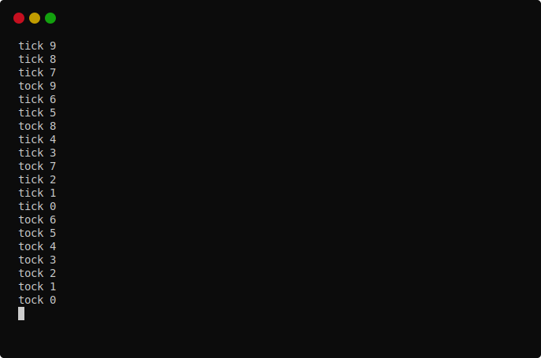

# EventQueue for CPS

[](https://github.com/disruptek/eventqueue/actions?query=workflow%3ACI)
[](https://github.com/disruptek/eventqueue/releases/latest)

[](#license)

This is a dispatcher for CPS which is designed to serve as a reference for
generic asynchronous I/O via selectors.

For more information on what this is and how you might use it, see
https://github.com/disruptek/cps.

The dispatcher is based upon
[selectors](https://nim-lang.org/docs/selectors.html), so you can see how the
features of that module will support typical I/O operations with CPS.

Windows is not supported by the dispatcher yet due to the lack of native
timer support in `selectors`, but [an ioselectors package that supports
Windows](https://github.com/xflywind/ioselectors) is in an advanced stage of
development.

## Example

```nim
# all cps programs need the cps macro to perform the transformation
import cps

# but each usage of the .cps. macro can have its own dispatcher
# implementation and continuation type, allowing you to implement
# custom forms of async or use an existing library implementation
from eventqueue import sleep, run, spawn, trampoline, Cont

# this procedure is written in a simple synchronous style, but when
# the .cps. is applied during compilation, it is rewritten to use
# the Cont type in a series of asynchronous continuations

proc tock(name: string; ms: int) {.cps: Cont.} =
  ## echo the `name` at `ms` millisecond intervals, ten times

  # a recent change to cps allows us to use type inference
  var count = 10

  # `for` loops are not supported yet
  while count > 0:

    dec count

    # the dispatcher supplied this primitive which receives the
    # continuation and returns control to the caller immediately
    sleep ms

    # subsequent control-flow is continues from the dispatcher
    # when it elects to resume the continuation
    echo name, " ", count

# NOTE: all the subsequent code is supplied by the chosen dispatcher

# the trampoline repeatedly invokes continuations until they
# complete or are queued in the dispatcher; this call does not block
trampoline tock("tick", ms = 300)

# you can also send a continuation directly to the dispatcher;
# this call does not block
spawn tock("tock", ms = 700)

# run the dispatcher to invoke its pending continuations from the queue;
# this is a blocking call that completes when the queue is empty
run()
```
...and when built with `--define:cpsDebug`, outputs something like...



[The source to the tick-tock test.](https://github.com/disruptek/eventqueue/blob/master/tests/tock.nim)

## Documentation

See [the documentation for eventqueue](https://disruptek.github.io/eventqueue/eventqueue.html) as generated directly from the source.
See also [the documentation for the cps module](https://disruptek.github.io/cps/cps.html).

## Tests

The tests provide the best examples of usage and are a great starting point for
your experiments.

[A few tests of eventqueue:](https://github.com/disruptek/eventqueue/blob/master/tests/test.nim)


## License
MIT
